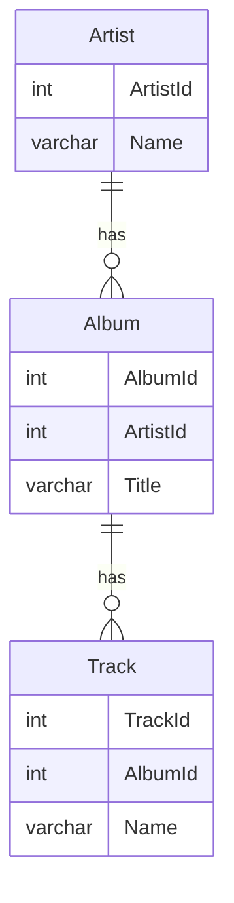
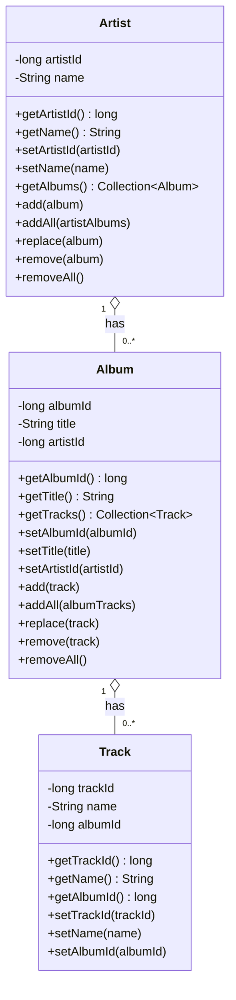

# edu-jdbc-crud
Assignment for course in Database development

## Entity Relationship Diagram

```mermaid
erDiagram
    Artist ||--o{ Album : has
    Album ||--o{ Track : has

    Artist {
        int ArtistId
        varchar Name
    }
    
    Album {
        int AlbumId
        int ArtistId
        varchar Title

    }

    Track {
    	int TrackId
	int AlbumId
	varchar Name

    }
```

## Class Diagram

```mermaid
classDiagram
    Artist "1" o-- "0..*" Album : has
    Album "1" o-- "0..*" Track : has

    class Artist {
    	-long artistId
    	-String name
    	+getArtistId() long
    	+getName() String
    	+setArtistId(artistId)
    	+setName(name)
    	+getAlbums() Collection~Album~
    	+add(album)
    	+addAll(artistAlbums)
    	+replace(album)
    	+remove(album)
    	+removeAll()
    }

    class Album {
    	-long albumId
    	-String title
    	-long artistId
    	+getAlbumId() long
    	+getTitle() String
    	+getTracks() Collection~Track~
    	+setAlbumId(albumId)
    	+setTitle(title)
    	+setArtistId(artistId)
    	+add(track)
    	+addAll(albumTracks)
    	+replace(track)
    	+remove(track)
    	+removeAll()
    }

    class Track {
    	-long trackId
    	-String name
    	-long albumId
    	+getTrackId() long
    	+getName() String
    	+getAlbumId() long
    	+setTrackId(trackId)
    	+setName(name)
    	+setAlbumId(albumId)
    }
```

CRUD JDBC
1. Run db_auto.sql in your docker mysql container
2. gradle test
